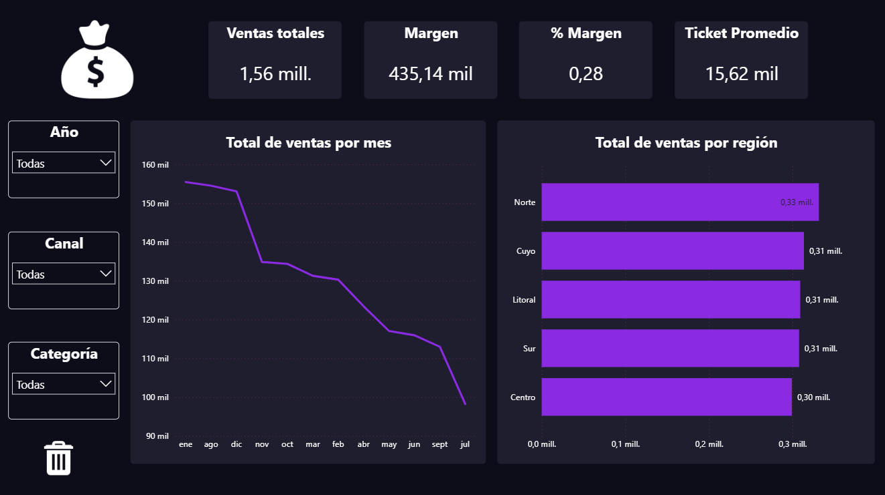
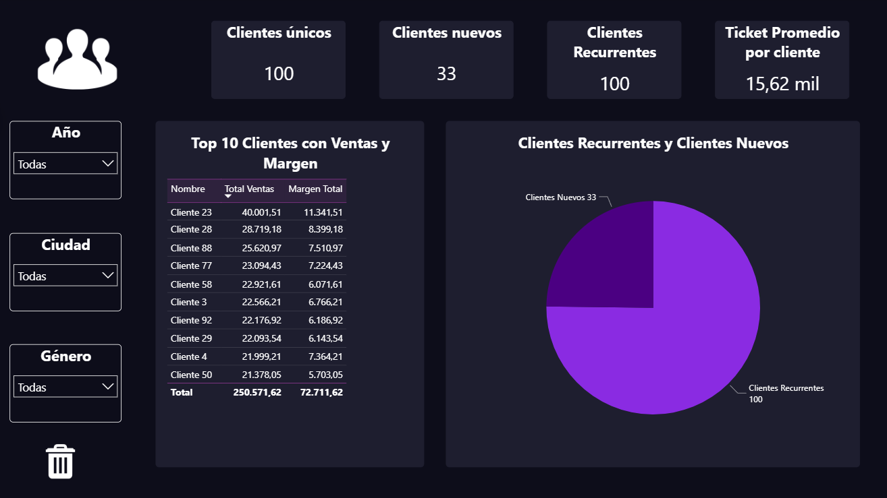
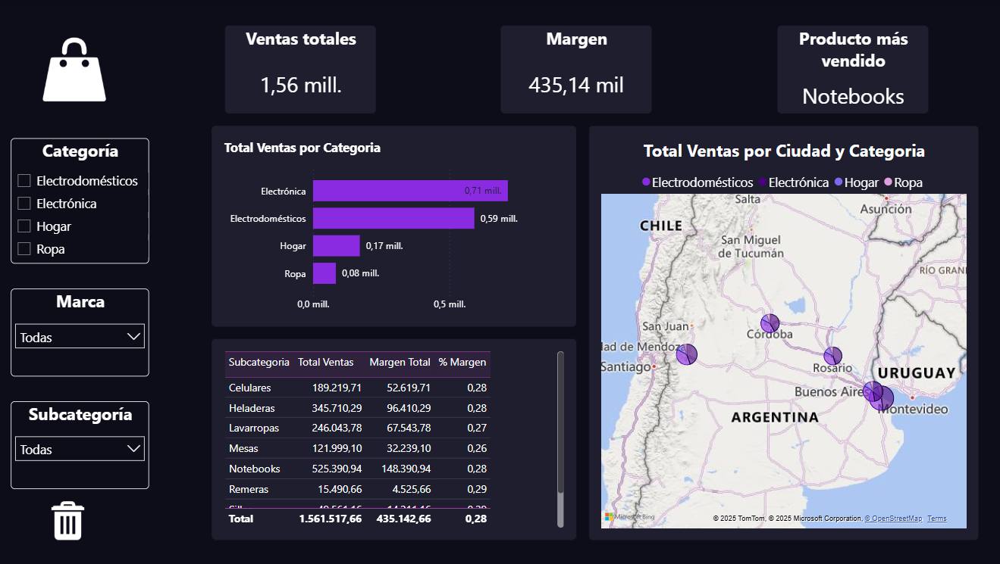

# 📊 Power BI Dashboard – Análisis Integral de Ventas, Clientes y Productos

## 🧠 Objetivo

Desarrollé un dashboard ejecutivo en **Power BI Desktop** para analizar el rendimiento comercial de una empresa de retail, integrando información de **ventas, clientes y productos**.  
El objetivo principal fue facilitar la toma de decisiones estratégicas mediante una visualización clara, interactiva y alineada con los indicadores clave del negocio (KPIs).

---

## ⚙️ Herramientas utilizadas

- 🧩 **Power BI Desktop** – Modelado de datos y diseño de dashboard.
- 🧼 **Power Query** – Limpieza y transformación de datos (Ventas, Clientes, Productos).
- 🧮 **DAX** – Creación de medidas y KPIs personalizados:
  - `Total Ventas`
  - `Margen` y `% Margen`
  - `Ticket Promedio`
  - `Clientes Nuevos` y `Recurrentes`
  - `Producto Más Vendido`
- 📈 **Visualizaciones** – Tarjetas KPI, gráficos de líneas, barras, circular y mapa geográfico.

---

## 🧩 Estructura del Dashboard

### 🟣 Página 1 – **Visión General**

- KPIs: **Ventas Totales**, **Margen**, **% Margen**, **Ticket Promedio**.
- Gráfico de líneas con evolución mensual de ventas.
- Gráfico de barras por **Región**.
- Segmentadores: **Año**, **Canal**, **Categoría**.
- Botón de 🗑 **“Borrar filtros”** para resetear visualizaciones.

---

### 🟣 Página 2 – **Clientes**

- KPIs: **Clientes Únicos**, **Clientes Nuevos**, **Recurrentes**, **Ticket Promedio por Cliente**.
- Tabla dinámica con los **Top 10 Clientes** según ventas y margen.
- Gráfico circular: **Clientes Nuevos vs Recurrentes**.
- Filtros por **Año**, **Ciudad** y **Género**.

---

### 🟣 Página 3 – **Productos**

- KPIs: **Ventas Totales**, **Margen** y **Producto Más Vendido**.
- Gráfico de barras: **Ventas por Categoría**.
- Mapa geográfico: **Ventas por Ciudad y Categoría**.
- Tabla de detalle: **Subcategoría, Ventas, Margen y % Margen**.
- Filtros por **Categoría**, **Marca** y **Subcategoría**.

---

## 📈 Resultados Clave

✅ Identificación de las categorías con mayor participación en ventas y margen.  
✅ Detección de clientes recurrentes que concentran la mayoría de las compras.  
✅ Visualización geográfica de las regiones con mejor desempeño comercial.  
✅ Dashboard completamente interactivo y optimizado para análisis ejecutivo.

---

## 💬 Tecnologías y habilidades

**Power BI · Power Query · DAX · Data Visualization · Data Modeling · Business Intelligence**

---

## 🖼️ Capturas del Dashboard

### 🔹 Página 1 – Visión General

### 🔹 Página 2 – Clientes

### 🔹 Página 3 – Productos

---

📂 **Autor:** Eduardo Ferré Valderrama  
📅 **Año:** 2025
